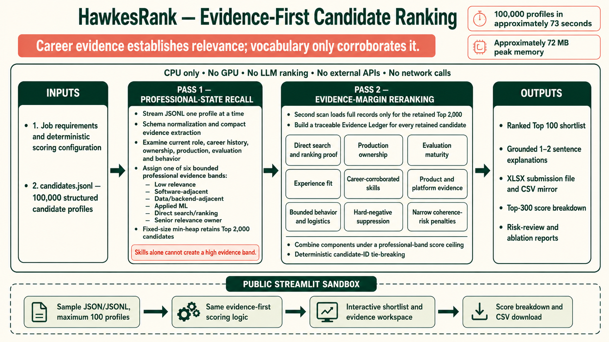

# HawkesRank

HawkesRank is a deterministic, CPU-only candidate ranker for the Redrob Intelligent Candidate Discovery challenge. Its central decision is simple: **career evidence establishes professional relevance; vocabulary only corroborates it**.

[](https://huggingface.co/spaces/KabeerY/HawkesRank)
[](https://huggingface.co/spaces/KabeerY/HawkesRank)
[](docs/methodology.md)

The submitted system makes no network calls, uses no hosted or local LLM, requires no GPU, and has no third-party ranking dependencies. On the released 100,000-profile JSONL it completes in about 73 seconds with approximately 72 MB peak resident memory on the development Mac.

## Result

The machine-validated canonical output is [`final/submission.csv`](final/submission.csv),
with [`final/submission.xlsx`](final/submission.xlsx) as the current portal-upload
mirror. Both contain exactly 100 unique candidates, ranks 1–100, strictly
decreasing scores, and one grounded 1–2 sentence explanation per candidate.

Latest measured run:

| Check | Result |
|---|---:|
| Profiles scanned | 100,000 |
| Wall-clock runtime | 72.77 s |
| Peak resident memory | 72.33 MB |
| Top-2,000 retained | 2,000 |
| Strict validation | passed |
| Top-100 bands | 25 senior relevance owners; 75 direct search/ranking |
| Top-100 flagged for manual risk review | 6 |

Runtime and memory are machine-dependent. The challenge limits are 300 seconds, 16 GB RAM, CPU only, and no network.

## Reproduce

Requirements: Python 3.11+ and the organizer-provided `candidates.jsonl` placed
in the repository root. The competition dataset is intentionally not
redistributed in this public repository.

```bash
python3 rank.py --candidates ./candidates.jsonl --output-root .
```

No package installation is required; ranking uses only the Python standard library. The command regenerates the inspection artifacts and `final/submission.csv` without manual steps.

Validate with the stricter project validator and invariant tests. The generated
CSV was also checked with the organizer-provided validator before submission:

```bash
python3 strict_validate.py final/submission.csv --candidates candidates.jsonl
python3 -m unittest discover -s tests -v
```

## Architecture



HawkesRank uses two passes over the JSONL:

1. **Professional-state recall.** A compact typed state is extracted while streaming all 100,000 records. Evidence from the current role and career history assigns one of six bounded professional bands. A fixed-size heap retains the best 2,000 profiles.
2. **Evidence-margin reranking.** Full evidence ledgers are built only for the retained pool. Direct retrieval/ranking proof, production ownership, evaluation maturity, experience fit, corroborated skills, bounded feasibility, near-miss suppression, and narrow coherence risks determine the final order.

The six evidence bands are: low relevance, software-adjacent, data/backend-adjacent, applied ML, direct search/ranking, and senior relevance owner. A candidate cannot cross into a high band from a skills list, side project, or keyword density alone.

Behavior and logistics reorder comparable technical profiles but do not redefine technical identity. Broad synthetic irregularities such as a repeated role description or inverted salary range are weak diagnostics. Strong penalties require narrow impossibilities or reinforcing contradictions.

Every score is decomposed into the components required for inspection in [`outputs/score_breakdown_top_300.csv`](outputs/score_breakdown_top_300.csv). The full rationale is in [`docs/methodology.md`](docs/methodology.md).

## Guardrails

- No candidate IDs, template counts, hidden tiers, or exact full-description labels are hardcoded.
- Current and prior career evidence outweigh headline, summary, and skills evidence.
- Repetition has diminishing returns; skills receive only a small weight and a separate corroboration score.
- Side-project-only AI, limited ownership, research-only work, generic CV/speech ML, services-only careers, weak evaluation, and weak availability are explicitly handled.
- Scores tie-break deterministically by candidate ID; exported scores are made strictly decreasing.
- Reasoning is generated only from ledger facts and records the most material concern when one exists.

## Repository map

```text
rank.py                         single reproduction entry point
assets/                         architecture and documentation visuals
hawkesrank/evidence.py         typed states, evidence extraction, bands and risk flags
hawkesrank/scoring.py          transparent component scoring and ablations
hawkesrank/reasoning.py        grounded candidate explanations
hawkesrank/pipeline.py         streaming two-pass pipeline and artifact generation
hawkesrank/validation.py       strict submission validation and hashing
tests/test_hawkesrank.py       ranking invariants
demo/                          isolated Streamlit/Docker small-sample sandbox
demo/HUGGINGFACE_README.md     deploy-ready Hugging Face Space card
docs/methodology.md            design, tradeoffs, and observed dataset structure
candidate_archetypes.md        full-dataset discovery report
outputs/                       inspection, breakdown, ablation, and run reports
final/submission.csv           canonical validator and reproducibility artifact
final/submission.xlsx          current portal-upload workbook mirroring the CSV
```

## Submission checklist

1. Replace the `TODO` identity, GitHub, and sandbox fields in `submission_metadata.yaml`.
2. Run both validators on `final/submission.csv`.
3. Confirm `final/submission.xlsx` mirrors the validated CSV, then rename it if
   the portal requires the registered participant ID.
4. Upload the XLSX in the portal's spreadsheet field and retain the CSV as the
   machine-verifiable source artifact.
5. Submit the repository URL, runnable sandbox link, contact details, AI-tool declaration, compute summary, and methodology summary through the portal.

The deployed small-sample sandbox is available on [Hugging Face Spaces](https://huggingface.co/spaces/KabeerY/HawkesRank). Its implementation and Docker recipe are in [`demo/`](demo/README.md).
